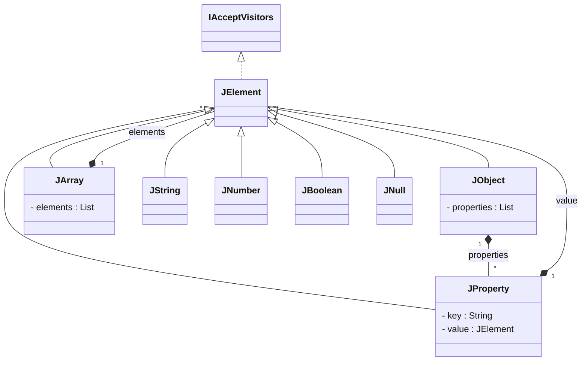

# json-kotlin-lib

A lightweight, zero‑dependency  Kotlin library that lets you **build, transform, validate and serve** JSON with an expressive DSL and a minimal HTTP layer.

---

## ✨ Highlights

* **Fluent DSL** to construct JSON objects / arrays in code
* **Immutable in‑memory model** (`JObject`, `JArray`, `JString`, `JNumber`, `JBoolean`, `JNull`)
* **Functional ops**:`filter`, `map`  on any node
* **Reflection** helper `toJson(any)` → auto‑convert  data classes, lists, maps, enums
* **Tiny HTTP server**(1 file, uses JDK `HttpServer`) + annotation‑based router
---




---

## 🏁 QuickStart

### 1—Add the library

```kotlin
repositories {
    mavenCentral() // or local Maven if you build from source
}

dependencies {
    implementation("com.github.mjsms:json‑kotlin‑lib:<version>")
}
```

### 2—Create JSON programmatically

```kotlin
val person = jsonObject {
    "name" to "Alice"
    "age"  to 30
    "skills" to jsonArray("Kotlin", "Docker")
}

println(person) // {"name":"Alice","age":30,"skills":["Kotlin","Docker"]}
```

### 3 — Convert any Kotlin object

```kotlin
@Serializable // not required; works via reflection
data class User(val id: Int, val name: String)

val json = toJson(User(1, "Bob"))
println(json) // {"id":1,"name":"Bob"}
```

### 4 — Expose a tiny REST endpoint

```kotlin
class HelloController {
    @Mapping("/hello/{name}")
    fun greet(@Path name: String) = jsonObject {
        "message" to "Hello, $name!"
    }
}

fun main() {
    GetJson(port = 8080, controllers = listOf(HelloController()))
}
```

Run → `curl http://localhost:8080/hello/Alice` → `{ "message": "Hello, Alice!" }`

---

## 📦 Building from source

```bash
git clone https://github.com/mjsms/json‑kotlin‑lib.git
cd json‑kotlin‑lib
./gradlew build  # creates build/libs/json‑kotlin‑lib‑<ver>.jar
```

Publish to local Maven (optional):

```bash
./gradlew publishToMavenLocal
```

---

## 🛠️ Architecture & Patterns

| Pattern         | Where / Why                                                           |
| --------------- | --------------------------------------------------------------------- |
| **Composite**   | `JElement` sealed hierarchy gives a uniform tree API                  |
| **Visitor**     | `JVisitor` enables pluggable traversals (validation, diff, stats)     |
| **Facade**      | `jsonObject { … }`, `jsonArray()` builders hide implementation detail |
| **Reflection**  | `toJson` inspects data classes, collections, maps                     |
| **Annotations** | `@Mapping`, `@Path`, `@Param` drive the HTTP router                   |

---

## 📄 License

This project is intended for academic use and is not licensed for production.
